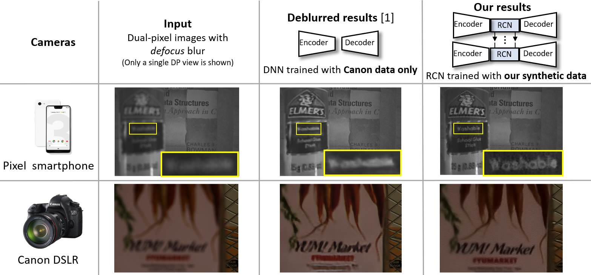

# Learning to Reduce Defocus Blur by Realistically Modeling Dual-Pixel Data

<p align="center">
				<a href="https://abuolaim.nowaty.com/">Abdullah Abuolaim<sup>1</sup></a>
&nbsp; &nbsp; 	<a href="https://iie.fing.edu.uy/~mdelbra/">Mauricio Delbracio<sup>2</sup></a>
&nbsp; &nbsp; 	<a href="https://research.google/people/DamienKelly/">Damien Kelly<sup>2</sup></a>
&nbsp; &nbsp; 	<a href="https://www.eecs.yorku.ca/~mbrown/">Michael S. Brown<sup>1</sup></a>
&nbsp; &nbsp; 	<a href="https://www.sites.google.com/view/milanfarhome/">Peyman Milanfar<sup>2</sup></a>
  <br>
  <sup>1</sup>York University &nbsp; &nbsp; &nbsp; &nbsp; <sup>2</sup>Google Research
</p>




Reference github repository for the paper [Learning to Reduce Defocus Blur by Realistically Modeling Dual-Pixel Data](https://arxiv.org/pdf/2012.03255.pdf). Abuolaim et al., proceedings of the IEEE/CVF International Conference on Computer Vision (ICCV) 2021 ([YouTube presentation](https://www.youtube.com/watch?v=SxLgE3xwBAQ)). If you use our dataset or code, please cite our paper:
```
@article{abuolaim2021learning,
  title={Learning to Reduce Defocus Blur by Realistically Modeling Dual-Pixel Data},
  author={Abuolaim, Abdullah and Delbracio, Mauricio and Kelly, Damien and Brown, Michael S and Milanfar, Peyman},
  booktitle={Proceedings of the IEEE/CVF International Conference on Computer Vision (ICCV)},
  year={2021}
}
```

## Synthetic Dataset

### Prerequisites
* The code tested with:
	* Python 3.8.3
	* Numpy 1.19.1
	* Scipy 1.5.2
	* Wand 0.6.3
	* Imageio 2.9.0
	* OpenCV 4.4.0
	
	<i>Despite not tested, the code may work with library versions other than the specified</i>

### Installation
* Clone with HTTPS this project to your local machine 
```bash
git clone https://github.com/Abdullah-Abuolaim/recurrent-defocus-deblurring-synth-dual-pixel.git
cd ./recurrent-defocus-deblurring-synth-dual-pixel/synthetic_dp_defocus_blur_code/
```

### Synthetic dual-pixel (DP) views based on defocus blur
* Download [SYNTHIA-SF dataset](http://synthia-dataset.net/download/973/) or visit [SYNTHIA downloads](https://synthia-dataset.net/downloads/)
	* SYNTHIA-SF dataset contains six image sequences: SEQ1-SEQ6
	* Traning: SEQ1, SEQ2, SEQ4, SEQ5, SEQ6
	* Testing: SEQ3

* Run the code in `synthetic_dp_defocus_blur_code` directory to start generating data as follows:
	```bash
	python synthetic_dp_defocus_blur.py --data_dir ./SYNTHIA-SF/ --radial_dis True
	```
	* <i>--data_dir</i>: path to the downloaded SYNTHIA-SF directory
	* <i>--radial_dis</i>: to apply radial distortion on the generated DP views

* Running above will create the generated dataset `dd_dp_dataset_synth_vid` in `synthetic_dp_defocus_blur_code`
	* Generate synthetic  image sequence for each camera set (i.e., the five camera sets defined in the main paper)
	* There will be 30 image sequences  generated in total (5 camera sets x 6 image sequences)
	
* The generated dataset is organized based on the following directory structure
	

	* $dir_name$_c: directory of the final output combined images
	* $dir_name$_l: directory of the corresponding DP left view images
	* $dir_name$_r: directory of the corresponding DP right view images
	* source: images exhibiting defocus blur
	* target: the corresponding all-in-focus images
	* seq_n: image sequence number

## RDPD Codes and Models

### Prerequisites
* The code tested with:
	* Python 3.8.3
	* TensorFlow 2.2.0
	* Keras 2.4.3
	* Numpy 1.19.1
	* Scipy 1.5.2
	* Scikit-image 0.16.2
	* Scikit-learn 0.23.2
	* OpenCV 4.4.0
	
	<i>Despite not tested, the code may work with library versions other than the specified</i>

### Installation
* Clone with HTTPS this project to your local machine 
```bash
git clone https://github.com/Abdullah-Abuolaim/recurrent-defocus-deblurring-synth-dual-pixel.git
cd ./recurrent-defocus-deblurring-synth-dual-pixel/rdpd_code/
```

### Testing
* All the trained models used in the main paper and supplemental material can be downloaded [link](https://ln4.sync.com/dl/5a02e15c0/e2c7em5x-v9rvmims-k3ut8svc-526gn59w)

* Place the downloaded `.hdf5` model inside `ModelCheckpoints` for testing

* Download DP defocus deblurring dataset [1] [link](https://ln2.sync.com/dl/c45358c50/r7kpybwk-xw8hhszh-qkj249ap-y8k2344d), or visit project GitHub [link](https://github.com/Abdullah-Abuolaim/defocus-deblurring-dual-pixel)

* After downloading and generating datasets, place them in the same directory e.g., `dd_dp_datasets`

* Run `main.py` in `rdpd_code` directory as follows:
	```bash
	python main.py --op_phase test --test_model RDPD+ --data_dir ./dd_dp_datasets/
	```
	* <i>--op_phase</i>: operation phase training or testing
	* <i>--test_model</i>: test model name
	* <i>--data_dir</i>: path to the directory that has both datasets i.e., `dd_dp_dataset_canon` and `dd_dp_dataset_synth_vid`

* The results of the tested models will be saved in `results` directory that will be created inside `rdpd_code`

<i>Recall that you might need to change </i>

### Training
* Download DP defocus deblurring dataset [1] [link](https://ln2.sync.com/dl/c45358c50/r7kpybwk-xw8hhszh-qkj249ap-y8k2344d), or visit project GitHub [link](https://github.com/Abdullah-Abuolaim/defocus-deblurring-dual-pixel)

* After downloading and generating datasets, place them in the same directory e.g., `dd_dp_datasets`

* Run `main.py` in `rdpd_code` directory as follows:
	```bash
	python main.py --op_phase train --ms_edge_loss True --data_dir ./dd_dp_datasets/
	```
	* <i>--op_phase</i>: operation phase training or testing
	* <i>--ms_edge_loss</i>: whether to use our edge loss or not in addition to the typical MSE loss
	* <i>--data_dir</i>: path to the directory that has both datasets i.e., `dd_dp_dataset_canon` and `dd_dp_dataset_synth_vid`

* Other training options
	* <i>--ms_edge_loss_weight_x</i>: the weight of our edge loss at the vertical direction
	* <i>--ms_edge_loss_weight_y</i>: the weight of our edge loss at the horizontal direction
	* <i>--patch_size</i>: training patch size
	* <i>--img_mini_b</i>: image mini-batch size
	* <i>--vid_mini_b</i>: video mini-batch size
	* <i>--num_frames</i>: number of video frames
	* <i>--epoch</i>: number of training epochs
	* <i>--lr</i>: initial learning rate
	* <i>--schedule_lr_rate'</i>: learning rate scheduler (after how many epochs to decrease)
	* <i>--dropout_rate'</i>: dropout rate of the `convLSTM` unit
	
* The trained model and checkpoints will be saved in `ModelCheckpoints` after each epoch

## Contact

Should you have any question/suggestion, please feel free to reach out:

[Abdullah Abuolaim](http://abuolaim.nowaty.com/) (abuolaim@eecs.yorku.ca)

## Related Links
* ECCV'18 paper: Revisiting Autofocus for Smartphone Cameras &nbsp; [[project page](https://abuolaim.nowaty.com/eccv_2018_autofocus/)]
* WACV'20 paper: Online Lens Motion Smoothing for Video Autofocus &nbsp; [[project page](https://abuolaim.nowaty.com/wacv_2020_autofocus_lens_motion/)] &nbsp; [[presentation](https://www.youtube.com/watch?v=85z075A3rI0)]
* ICCP'20 paper: Modeling Defocus-Disparity in Dual-Pixel Sensors &nbsp; [[github](https://github.com/abhijithpunnappurath/dual-pixel-defocus-disparity)] &nbsp; [[presentation](https://www.youtube.com/watch?v=Ow2ffrqjPiI)]
* ECCV'20 paper: Defocus Deblurring Using Dual-Pixel Data &nbsp; [[project page](https://abuolaim.nowaty.com/eccv_2020_dp_defocus_deblurring/)] &nbsp; [[github](https://github.com/Abdullah-Abuolaim/defocus-deblurring-dual-pixel)] &nbsp; [[presentation](https://www.youtube.com/watch?v=xb12cFiB8ww)]
* CVPRW'21 paper: NTIRE 2021 Challenge for Defocus Deblurring Using Dual-pixel Images: Methods and Results &nbsp; [[pdf](https://openaccess.thecvf.com/content/CVPR2021W/NTIRE/papers/Abuolaim_NTIRE_2021_Challenge_for_Defocus_Deblurring_Using_Dual-Pixel_Images_Methods_CVPRW_2021_paper.pdf)] &nbsp; [[presentation](https://www.youtube.com/watch?v=OC52DLyz1lU)]
* WACV'22 paper: Improving Single-Image Defocus Deblurring: How Dual-Pixel Images Help Through Multi-Task Learning &nbsp; [[github](https://github.com/Abdullah-Abuolaim/multi-task-defocus-deblurring-dual-pixel-nimat)] &nbsp; [[presentation](https://www.youtube.com/watch?v=eE9i81D3_Os)]
* WACVW'22 paper: Multi-View Motion Synthesis via Applying Rotated Dual-Pixel Blur Kernels &nbsp; [[pdf](https://arxiv.org/pdf/2111.07837.pdf)] &nbsp; [[presentation](https://youtu.be/eIquI76r0dw)]

## References
[1] Abdullah Abuolaim and Michael S. Brown. *Defocus Deblurring Using Dual-Pixel Data.* In ECCV, 2020.
